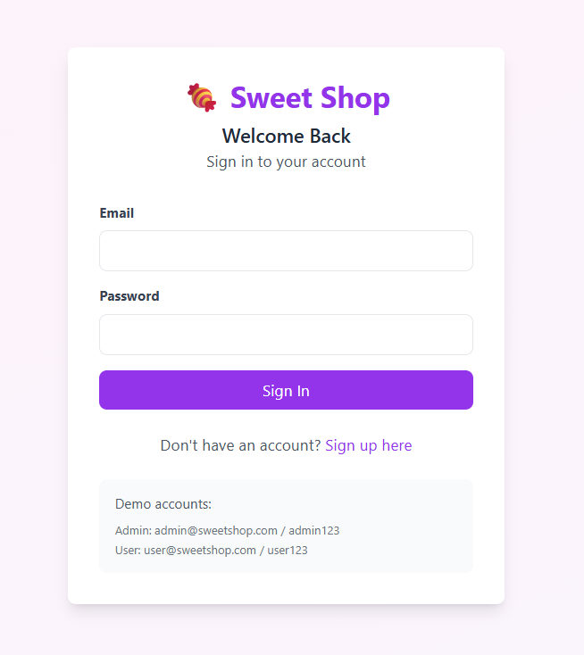
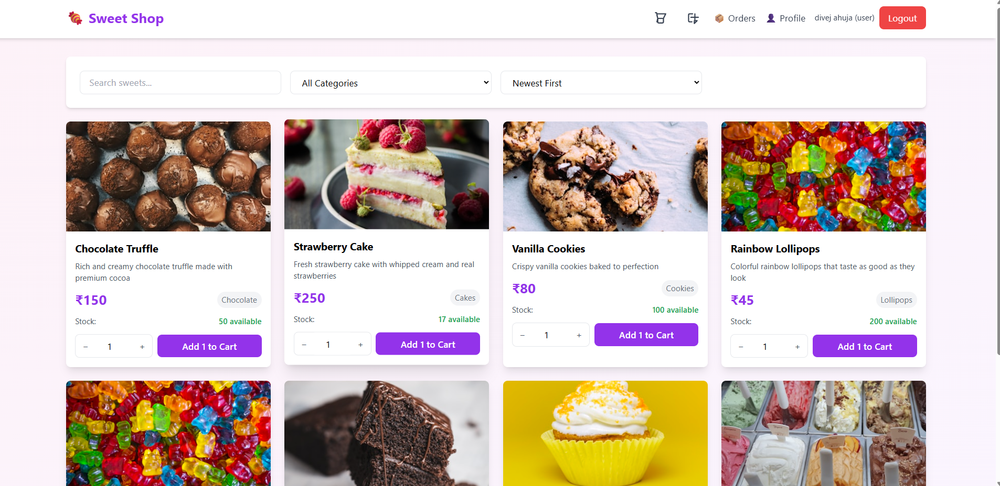
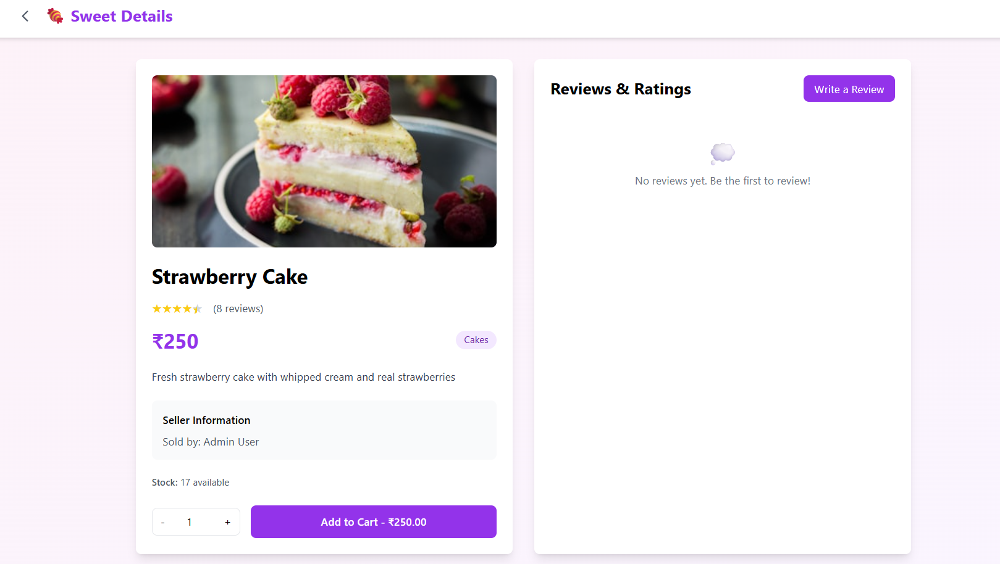
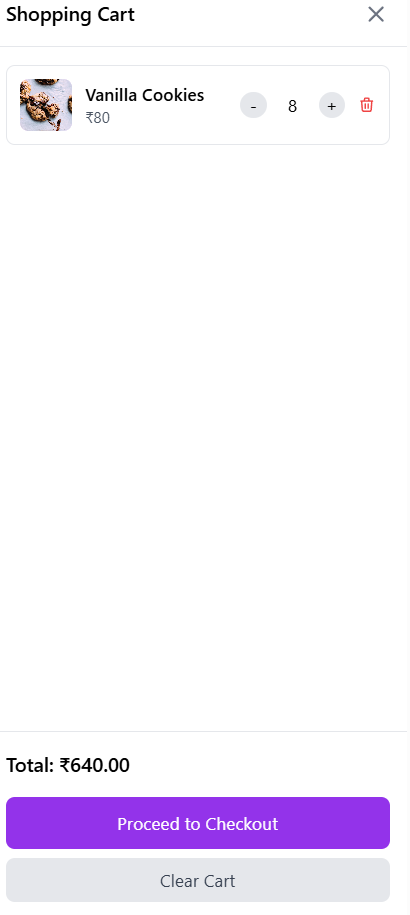
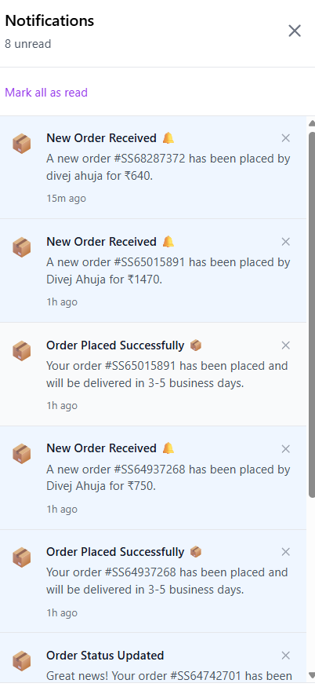
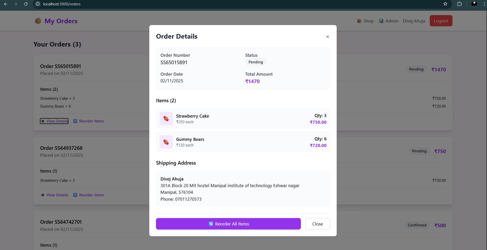
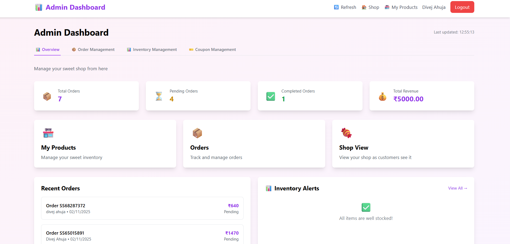
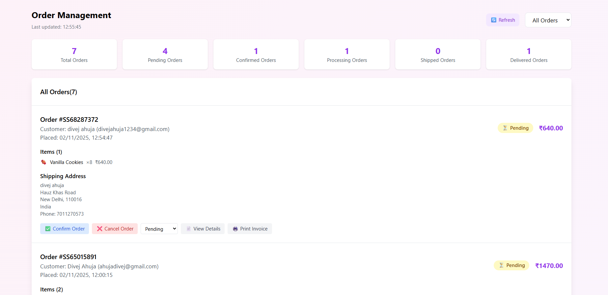

# 🍬 Sweet Shop - E-commerce Platform

<div align="center">


[](https://reactjs.org/)
[](https://nodejs.org/)
[](https://mongodb.com/)
[](https://expressjs.com/)

**A modern full-stack e-commerce platform for sweet shops with real-time notifications, order tracking, and admin dashboard.**

**Developed by: Divej Ahuja**

</div>

## 📸 Application Screenshots

### 🔐 Login Page

*Secure user authentication with clean and intuitive login interface*

### 🏠 Homepage & Product Catalog

*Browse through our extensive collection of sweets with search and filter options*

### 🍬 Product Details Page

*Detailed product view with descriptions, pricing, and add to cart functionality*

### � Shopp ing Cart & Checkout

*Seamless shopping experience with real-time cart updates and secure checkout*

### 🔔 Notifications System

*Real-time notifications for order updates, low stock alerts, and system messages*

### 📋 Customer Order Details

*Comprehensive order tracking and details for customers with status updates*

### 👨‍💼 Admin Dashboard

*Comprehensive admin panel for managing products, orders, and analytics*

### 📊 Order Management (Admin)

*Admin order management with real-time status updates and delivery tracking*

## 🌟 Key Features

### 🛍️ For Customers
- **User Authentication** - Secure login/register system
- **Product Catalog** - Browse sweets with search and filters
- **Shopping Cart** - Real-time cart with price calculation
- **Order Tracking** - Track delivery status in real-time
- **Reviews & Ratings** - Rate and review products
- **Responsive Design** - Works on all devices

### 👨‍💼 For Admins
- **Dashboard Analytics** - Sales overview and metrics
- **Inventory Management** - Add, edit, delete products
- **Order Management** - Process and track orders
- **Coupon System** - Create discount codes
- **Low Stock Alerts** - Automated inventory notifications
- **User Management** - Manage customer accounts

## 🛠️ Tech Stack

**Frontend:** React 18, Vite, Tailwind CSS, React Router, Axios  
**Backend:** Node.js, Express.js, MongoDB, Mongoose, JWT  
**Testing:** Jest

## 🚀 Quick Start

### Prerequisites
- Node.js (v18+)
- MongoDB (local or Atlas)
- Git

### Installation

1. **Clone & Install**
   ```bash
   git clone https://github.com/DIVEJ131203/SWEET_SHOP.git
   cd sweet-shop
   
   # Backend setup
   cd BACKEND && npm install
   
   # Frontend setup
   cd ../FRONTEND/frontend && npm install
   ```

2. **Environment Setup**
   
   **Backend `.env`:**
   ```env
   MONGODB_URI=mongodb://localhost:27017/sweetshop
   JWT_SECRET=your_secret_key_here
   FRONTEND_URL=http://localhost:5173
   ```
   
   **Frontend `.env`:**
   ```env
   VITE_API_URL=http://localhost:5000/api
   ```

3. **Run Application**
   ```bash
   # Terminal 1 - Backend
   cd BACKEND && npm run dev
   
   # Terminal 2 - Frontend  
   cd FRONTEND/frontend && npm run dev
   ```

4. **Seed Database**
   ```bash
   cd BACKEND && npm run seed
   ```

### 🌐 Access
- **Frontend**: http://localhost:5173
- **Backend API**: http://localhost:5000/api

### 👤 Test Credentials
- **Admin**: admin@sweetshop.com / admin123
- **User**: user@sweetshop.com / user123

## 📡 API Endpoints

### Authentication
- `POST /api/auth/register` - Register user
- `POST /api/auth/login` - Login user
- `GET /api/auth/me` - Get current user

### Products
- `GET /api/sweets` - Get all products
- `POST /api/sweets` - Create product (Admin)
- `PUT /api/sweets/:id` - Update product (Admin)
- `DELETE /api/sweets/:id` - Delete product (Admin)

### Orders & Cart
- `GET /api/orders` - Get user orders
- `POST /api/orders` - Create order
- `GET /api/cart` - Get cart items
- `POST /api/cart` - Add to cart

### Reviews & Coupons
- `GET /api/reviews/:sweetId` - Get product reviews
- `POST /api/reviews` - Add review
- `GET /api/coupons/validate/:code` - Validate coupon
- `POST /api/coupons` - Create coupon (Admin)

## 🔐 Security Features
- JWT Authentication
- Password hashing with bcrypt
- Role-based access control
- Input validation
- CORS protection

## 🧪 Testing
```bash
# Backend tests
cd BACKEND && npm test

# Frontend tests
cd FRONTEND/frontend && npm test
```


## 📝 AI Usage Reflection

### Tools Used
- **ChatGPT** - Idea generation, feature planning, and architecture decisions
- **Kiro AI Assistant** - Code generation, debugging, project structure


### Impact on Workflow
AI tools accelerated development by ~40%, particularly for:
- **Idea Generation** - ChatGPT helped brainstorm features, user stories, and technical approaches
- **Boilerplate code generation** - Kiro AI generated initial project structure and templates
- **CRUD operations** - Automated creation of standard database operations
- **Authentication flow implementation** - AI-assisted JWT and security implementation
- **Debugging and error resolution** - Quick identification and fixing of issues
- **Tailwind CSS styling** - Copilot suggestions for responsive design classes

The AI suggestions helped focus more on business logic and user experience rather than syntax. ChatGPT was particularly valuable for conceptualizing the e-commerce workflow and feature requirements. Manual review and testing ensured code quality while AI handled repetitive tasks.

## 👨‍💻 Author

**Divej Ahuja**

## 🤝 Contributing

Contributions, issues, and feature requests are welcome!

---

*A full-stack e-commerce platform built with modern web technologies*
